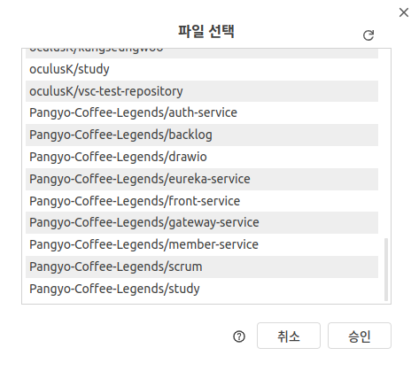
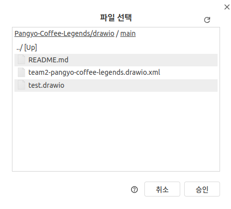

# drawio
draw.io 를 이용하여 우리의 요구상황을 봅니다.

---
## 1. draw.io 를 주소창에 입력하여 들어간다.
## 2. 기존 다이어그램 들어가기를 누른다.

## 3. drawio를 선택한다.

## 4. team2-pangyo-coffee-legends.drawio.xml 을 선택하여 들어온다.

## 5. 우리의 drawio 의 정보에 들어올 수 있게 된다!